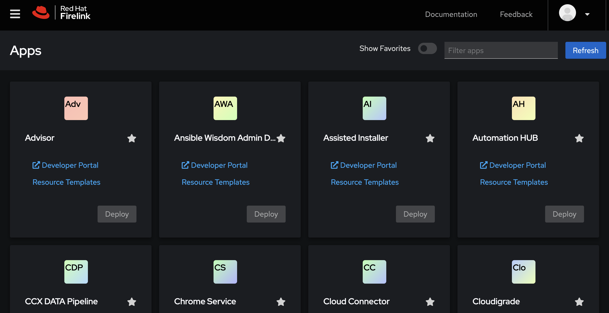
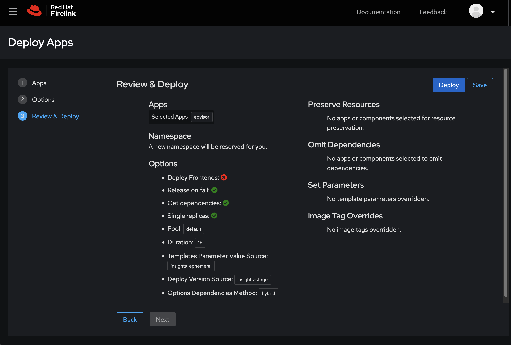

# Apps
The Apps menu contains features that allow you to view information Apps and deploy them into ephemeral environments.

## App List

[App List](https://firelink.apps.crc-eph.r9lp.p1.openshiftapps.com/apps/list) lets you view all of the apps available to deploy. Each App Card contains links to its resource templates and its page on the Developer Portal. Click the Star on an App Card to add or remove that app from your favorites. Click the Deploy button on an App Card to deploy that app. You can filter the app list or show just your favorites.

## App Deploy

[App Deploy](https://firelink.apps.crc-eph.r9lp.p1.openshiftapps.com/apps/deploy) lets you deploy apps into ephemeral namespaces and to set all of the various options that are allowed during a deploy including:

* Deploy frontends
* Change reference environments
* Change target environments
* Omit dependencies
* Preserve resources
* Override Image Tags
* Set Template Paramters
* And more!

If you can set an option for a deploy in Bonfire you can very likely do the same thing via the App Deploy page. The caveat is that any features that requires local config will not work, but the majority of options are present.

You can select an App from the list. If you got to the deploy page from the App List your app will already be selected, but you can select multiple.

Click the "Quick Deploy" button to deploy with default options. 

Step through the Wizard with the Next and Back buttons to move through the deployment flow. Most options and features have help text to explain what they mean, and wherever possible Firelink will restrict your inputs to valid inputs.

By default Firelink will provide you a curated list of common option. Click the Advanced Options button to enter into the advanced deploy workflow. This will allow you to set any option Bonfire can set.

After you've set all of the defploy options you can click Deploy to deploy your apps to the ephemeral cluster. You can click Save to save your deployment as a Recipe that you can access from the User Menu.