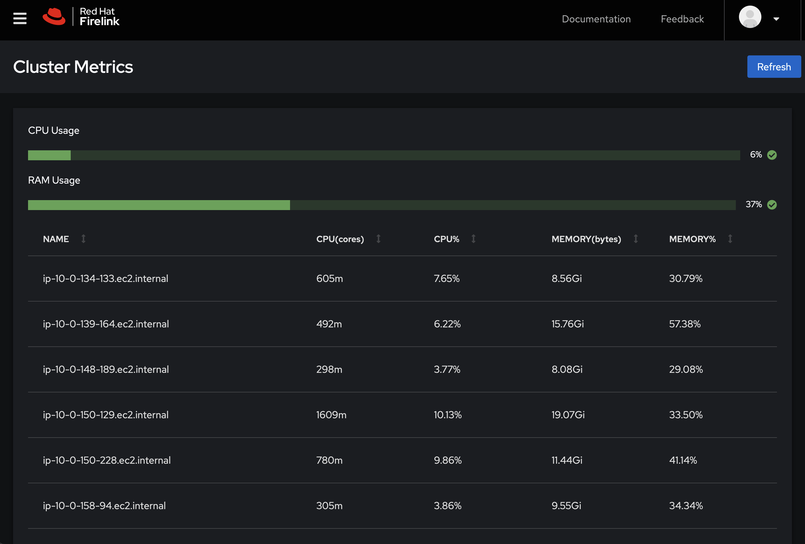

# Cluster

[Cluster](https://firelink.apps.crc-eph.r9lp.p1.openshiftapps.com/cluster) allows you to view high level metrics about the ephemeral cluster's resource usage as a proxy for cluster health.

The bars at the top show the percentage of Memory and CPU in use. The node table can be sorted by any column and shows CPU cores, RAM in Gi, and usage percentages for both.