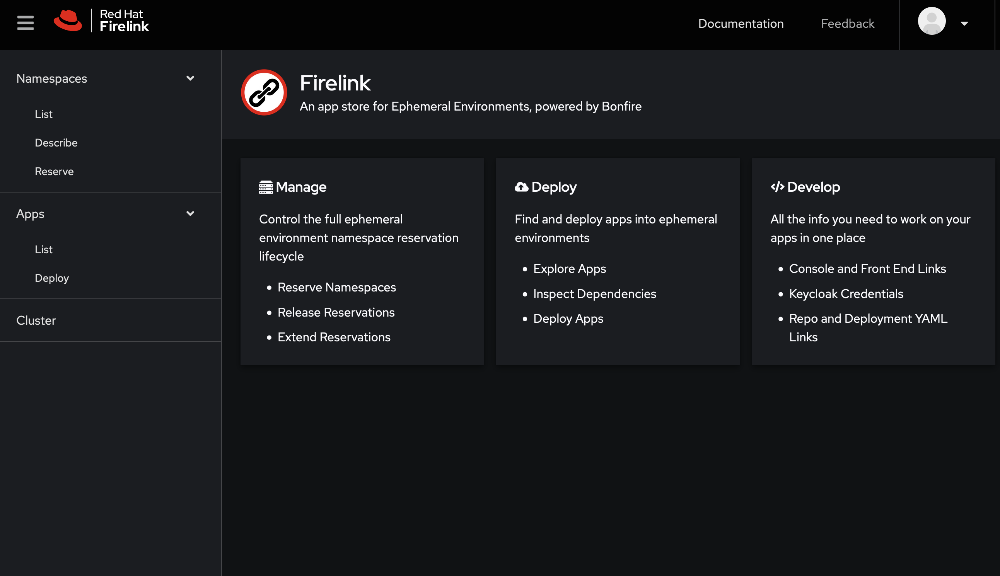

# Firelink
An app store for Ephemeral, powered by Bonfire.

## About
[Firelink](https://firelink.apps.crc-eph.r9lp.p1.openshiftapps.com/) is a web app that helps you perform multiple ephemeral environment tasks such as:

* Reserve namespaces
* Get namespace information such as metrics, URLs, and passwords
* Deploy apps into ephemeral environments
* Get information on apps including developer portal links and resource templates
* View high level cluster health metrics
* And more!

If you can do it in [Bonfire](https://backstage.stage.devshift.net/catalog/default/component/bonfire), you can probly do it in Firelink. However, we want to provide more than just Bonfire functionality. We want to surface additional features that are useful to ephemeral environment users that don't make sense in the context of a CLI app.

## Architecture 
Firelink is made up of 3 projects:

* [Firelink Service](https://backstage.stage.devshift.net/catalog/default/component/firelink-backend): A REST API that provides Bonfire functionality
* [Firelink Frontend](https://backstage.stage.devshift.net/catalog/default/component/firelink-frontend): A React and Patternfly SPA
* [Firelink Proxy](https://backstage.stage.devshift.net/catalog/default/component/firelink-proxy): An Openshift OAuth Proxy for running securely on Openshift

Firelink Service imports Bonfire as a library, wraps it in a thin layer of adaptor classes, and exposes it via a Flask REST API. This allows Firelink to provide the full range of ephemeral environment functionality via the mature and well tested Bonfire code without duplicating effort.
