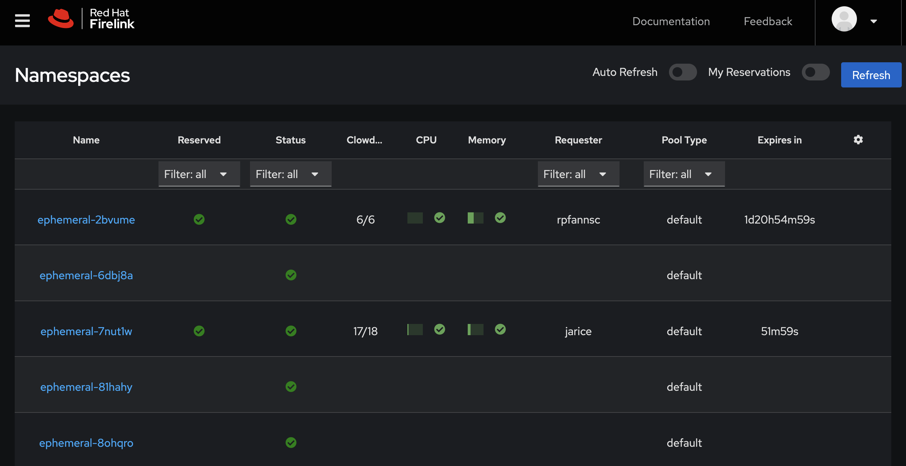
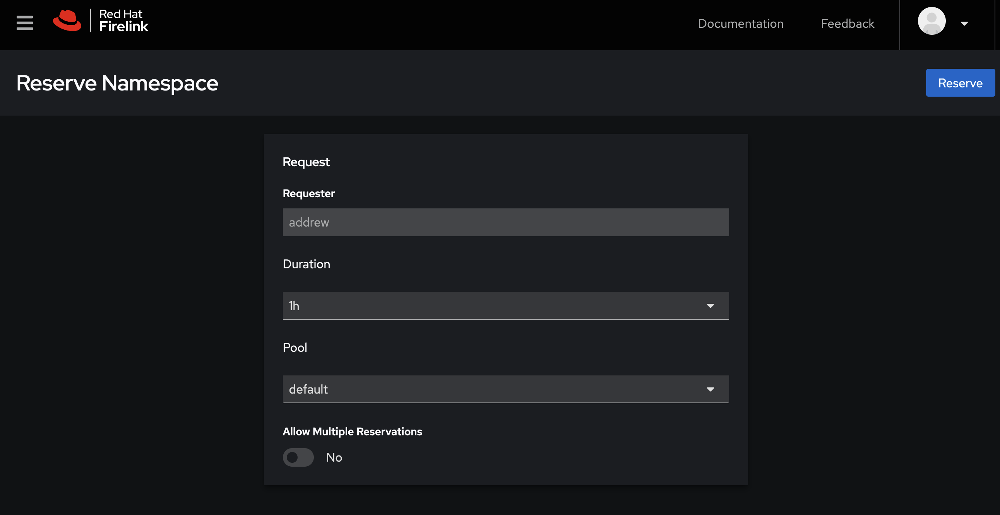
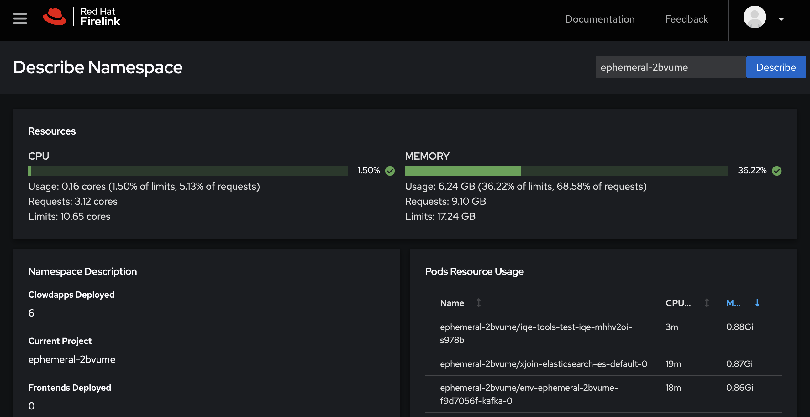

# Namespaces
The Namespaces menu contains the List, Describe, and Reserve features.

## List

[The Namespace List](https://firelink.apps.crc-eph.r9lp.p1.openshiftapps.com/namespace/list) allows you to view the namespaces on the ephemeral cluster along with relavent information. The columns are:

* The name of the namespace. Click on the namespace name to be taken to the Describe page.
* Whether the namesapce is reserved or not
* A green check mark if the namespace is in "ready" state
* Clowdapps ready / Clowdapps deployed
* CPU utilization vs. requests and limits
* Memory utilization vs. requests and limits
* The owner of the namespace
* The type of pool used for the namespace
* When the namespace expires
* A tools column that will show a menu for namespaces you reserved

The tool bar at the top lets you set the namespace list to auto refresh, see only your reservations, or force a refresh.

### Resource Utilization
The CPU and Memory utilization graphs are intended to provide a glanceable high level view of the resource utilization vs the requests and limits. 

The graph will be green if you are within your requests. It will be yellow if you are above your requsts but less than 80% of your limits. It will be red if you are over 80% of your limits. You can hover over the graph to see a tool tip with the exact numbers in it.

Resource metric usage is expesnive to calculate, so values are cached for 2 minutes. If you encounter a cache miss it may take up to 5 seconds for the resource graphs to appear.

## Reserve

[Reserve](https://firelink.apps.crc-eph.r9lp.p1.openshiftapps.com/namespace/reserve) allows you to reserve a namespace. You can set a few basic options such as the duration of the reservation or the pool. The "Allow Multiple Reservations" switch will allow you to reserve a new namespace even if you already have one reserved.

## Describe

[Describe](https://firelink.apps.crc-eph.r9lp.p1.openshiftapps.com/namespace/describe) provides information useful for understanding your namespace and deployments. The Resource Utilization chart at the top shows the CPU and Memory resource utilization figures versus the requests and limits. It works via the same system as the resource utilization graphs on the Namespace List described above.

The Pod Resources Usage shows you the pods in your namespace along with their resource utilization. You can sort the table by clicking on the column headers.

The Namespace Description panel shows you valuable information such as the various URLs and passwords associated with your namespace, as well as clowdapps, frontends, and more.

The metrics on this page automatically refresh as you keep the feature open.
