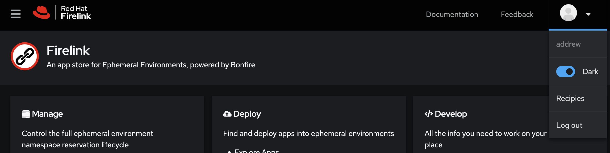
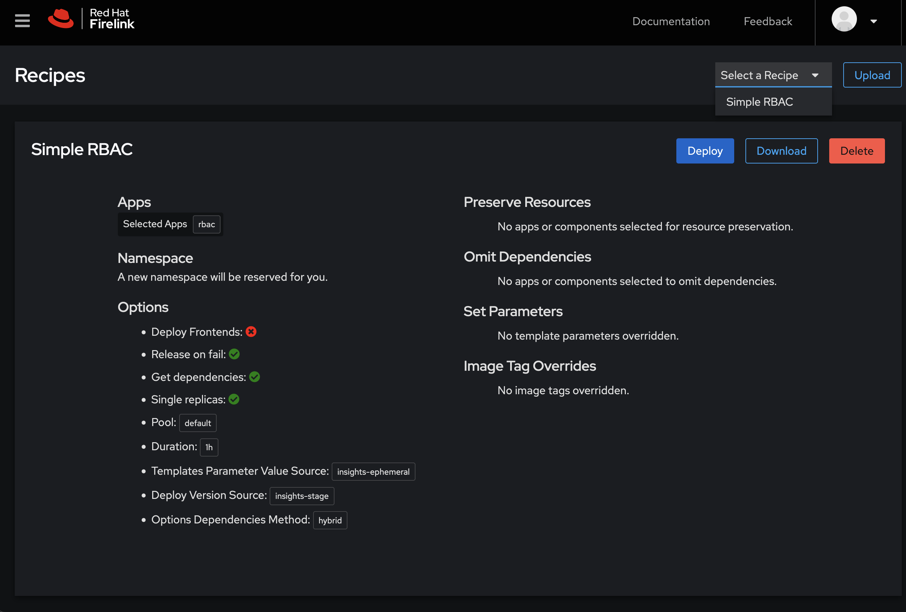

# User Menu

The user menu allows you to:

* See your user name on the cluster. This is the user name that will show up on your reservations.
* Toggle light or dark mode
* Recipes lets you manage your saved deployment recipes

## Recipes

[Recipes](https://firelink.apps.crc-eph.r9lp.p1.openshiftapps.com/recipes) are deployments you've created and save. After going through a a [Deploy](https://firelink.apps.crc-eph.r9lp.p1.openshiftapps.com/apps/deploy) workflow you will be presented an option to Save a Recipe. Saved recipes show up in the Recipes feature accessed from the User Menu. From the Recipes feature you can select, deploy, or delete your saved recipes.